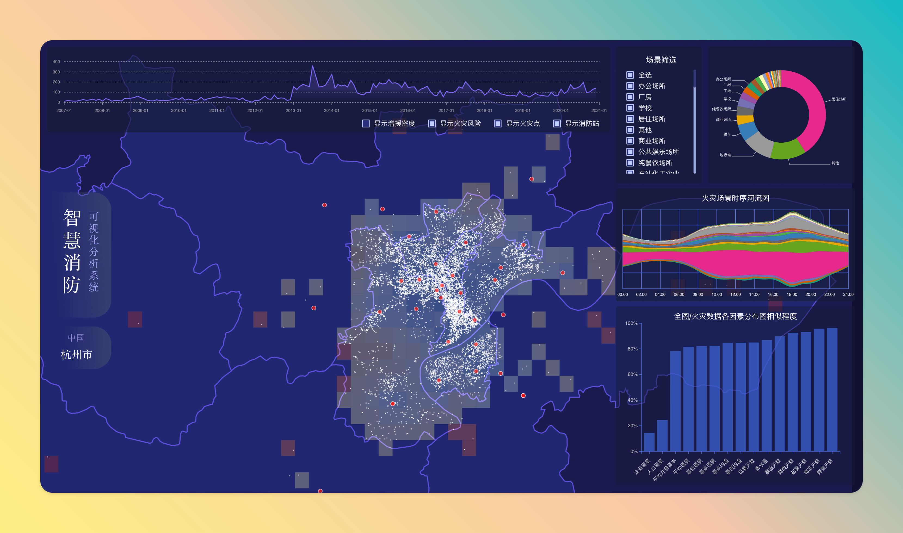
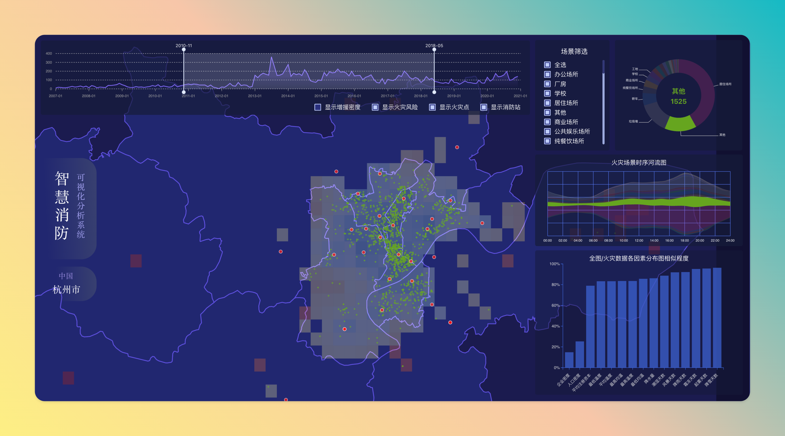
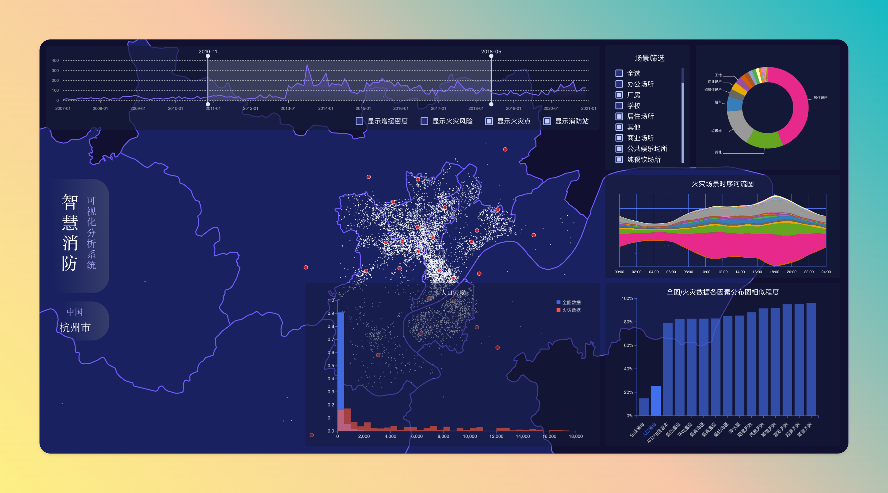

# Firewise Data Visualization System

This repository houses the code for the SIST ARTS1422 Data Visualization final course project, developed using Vue3, Typescript, and D3.js. We've deployed a [live demo](https://data-vis-frontend.project.liguohan.com/) on vercel so you can check it out quickly.

## Install

The `src` directory houses all the code files, and the `public` directory houses the preprocessed data files.

To run this code, first make sure you have `node.js` and `npm` on your computer.

In the project root directory, run the following command to install the required dependencies.

```sh
npm intsall
```

Run the following command to start the project.

```sh
npm run dev
```

## Screenshot






